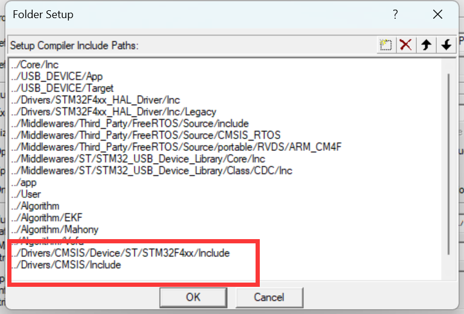
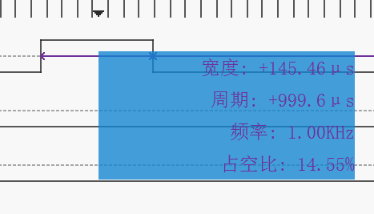

# 达妙F446开发板姿态解算

此惯导姿态解算算法EKF部分移植于：[WangHongxi2001/RoboMaster-C-Board-INS-Example (github.com)](https://github.com/WangHongxi2001/RoboMaster-C-Board-INS-Example)，Mahony部分我魔改了一部分。具体原理请看上面链接，同时还有开源的Mahony算法作为对比测试,开启了H7的cache作为优化，同时大量使用arm的dsp库进行优化。具体移植注意事项请看下文。

## 注意：

AC5的文件夹是使用AC5编译器的Code，AC6文件夹装着的是AC6的Code。需要注意的是AC6，如果使用cubemx重新生成后需要替换freertos中RVDS中的文件为armgcc中的文件，否则会导致编译失败。具体可以查阅相关资料。要注意如果是用cubemx重新生成了，需要将这里的两个path删除，才能正常编译，否则会出现arm_math重复引用等问题很玄学我不懂。希望有人指点指点

## 实际测试

开源Mahony算法-包含四元数转欧拉角的部分为1.33us,加四元数转欧拉角只需要520ns（这个是达妙H723的时间，f446的我懒得测了 23333）


开源EKF姿态解算算法-包含四元数转欧拉角的部分，总共为145.46us.



### 开发板购买链接

https://item.taobao.com/item.htm?ft=t&id=767305853444


## 使用注意事项：

1.上电后先进行恒温控制（温度控制我简单的调了一下PID，具体可以打开DEBUG进行设定，不同的电压PID可能稍有差别，需要对PID进行调整），当温度达到设定温度（40°），进行一个计数，当计数值达到阈值（目的是确保温度已经到40度附近）才进行到第二个状态

2.第二个状态，即attitude_flag==1，进行陀螺仪0飘初始化，此过程中需要保持开发板静止。初始化结束后进入第三个状态

3.attitude_flag==2，进行姿态解算

```c
IMU_QuaternionEKF_Update(gyro[0],gyro[1],gyro[2],accel[0],accel[1],accel[2]);//ekf姿态解算部分		
//mahony姿态解算部分
//HAL_GPIO_WritePin(GPIOE,GPIO_PIN_13,GPIO_PIN_SET);
Mahony_update(gyro[0],gyro[1],gyro[2],accel[0],accel[1],accel[2],0,0,0);
Mahony_computeAngles(); //角度计算
//HAL_GPIO_WritePin(GPIOE,GPIO_PIN_13,GPIO_PIN_RESET);				//=========================================================================
//ekf获取姿态角度函数
pitch=Get_Pitch(); //获得pitch
roll=Get_Roll();//获得roll
yaw=Get_Yaw();//获得yaw
```

此代码中，cheat是通过一定的作弊手段，去掉了陀螺仪gyro[2]小的值 从而使得yaw完全静止不太飘，如果应用场景角速度变化不明显建议去掉。

获得陀螺仪的pitch，roll，yaw通过调用函数。

四元数位于QEKF_INS.q 的数组中

### 串口显示曲线

***********************************************************************
默认开了一个线程通过USB CDC进行上位机数据发送，文件位于Algorithm.c。

上位机默认协议使用vofa的justfloat协议。vofa下载链接：[VOFA-Plus上位机 | VOFA-Plus上位机](https://www.vofa.plus/)

虚拟串口为自动波特率可以随意设置，自动识别。

发送的四个口分别为pitch，roll，yaw，temp。temp为陀螺仪温度可以用于调节温度控制PID

```c
void vofa_demo(void) 
{

	// Call the function to store the data in the buffer
	//===========================================================
	//ekf姿态解算的值
	vofa_send_data(0, pitch);
	vofa_send_data(1, roll);
	vofa_send_data(2, yaw);
	//==========================================================
	
	//====================================================
	//mahony解算的值
	vofa_send_data(3, pitch_mahony);
	vofa_send_data(4, roll_mahony);
	vofa_send_data(5, yaw_mahony);
	//========================================================
	
	vofa_send_data(6, temp); //陀螺仪加热温度
	vofa_send_data(7, H723_Temperature);//h723内部温度
	// Call the function to send the frame tail
	vofa_sendframetail();
}
```

## 移植注意

mahony代码只有mahonyahrs.c/.h文件，ekf在QuaternionEKF还有kalman_filter 的.c/.h中

### EKF部分

需要实现这里的malloc，这里本文使用freertos的malloc来托管。

```c
void* user_malloc(size_t size)
{
	void* tmp = 0;
	tmp = pvPortMalloc(size);
	return tmp;
}
```

如果移植到别的平台还需要优化kalman_filter.h里面的

```c

#define mat arm_matrix_instance_f32
#define Matrix_Init arm_mat_init_f32
#define Matrix_Add arm_mat_add_f32
#define Matrix_Subtract arm_mat_sub_f32
#define Matrix_Multiply arm_mat_mult_f32
#define Matrix_Transpose arm_mat_trans_f32
#define Matrix_Inverse arm_mat_inverse_f32
```

同时本文使用了dsp库中的函数加速，如果移植到别的平台还需要解决以下函数。

arm_atan2_f32    反正切函数 替换为相应平台的反正切

__sqrtf(x);   为dsp库内的 1/sqrt(t)函数。可以使用 mahonyahrs.c库中的 float Mahony_invSqrt(float x)来代替，

### Mahony部分

这个函数由于只有arm平台可以使用，别的平台请使用另外一个函数：float Mahony_invSqrt(float x)，也在mahonyahrs文件中

```c
static float invSqrt(float x)  // if use other platform please use float Mahony_invSqrt(float x)
{
	volatile float tmp = 1.0f;
	tmp /= __sqrtf(x);
	return tmp;
}
```

下面这个函数为所有平台都可以用的invSqrt函数，用于加速sqrt过程。

```c
float Mahony_invSqrt(float x)
{
	float halfx = 0.5f * x;
	float y = x;
	long i = *(long*)&y;
	i = 0x5f3759df - (i>>1);
	y = *(float*)&i;
	y = y * (1.5f - (halfx * y * y));
	y = y * (1.5f - (halfx * y * y));
	return y;
}
```

如果移植到别的平台还需要解决，同ekf一样只要将arm_atan2_f32替换为自己平台的atan2。

```c
void Mahony_computeAngles()
{
	arm_atan2_f32(q0*q1 + q2*q3, 0.5f - q1*q1 - q2*q2,&roll_mahony);  
	roll_mahony *= 57.29578f;  
	pitch_mahony =57.29578f * asinf(-2.0f * (q1*q3 - q0*q2));
	arm_atan2_f32(q1*q2 + q0*q3, 0.5f - q2*q2 - q3*q3,&yaw_mahony); 
	yaw_mahony *=57.29578f;
	anglesComputed = 1;
}
```

